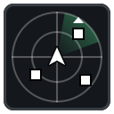

<p align="center">
  
</p>

<h1 align="center">Minty Radar</h1>

<p align="center">
  A client-side Fabric mod for Minecraft 26.3 that shows nearby players on a mini radar.
</p>

---

## Features

- **Rotating mini radar.** Your view direction always points up, and players move smoothly on the radar as you turn and walk.
- **Player heads.** Each player shows as their own skin face, including the hat (outer) layer. You can switch to plain dots instead.
- **Height markers.** A **Δ** shows a player is above you, and a **∇** shows they're below you.
- **Players beyond range.** They're pinned to the radar's edge as faded markers, so you still know which way they are.
- **Names on the radar.** Show player names above their heads always, only while you hold sneak, or never.
- **Player list.** Every player the radar can see, nearest first, with their head, name and distance in blocks.
- **Zoom.** Radar range of 32, 48, 64, 96 or 128 blocks.
- **In-game settings screen.** Every setting and keybind can be changed in game. Press `O`, or use Mod Menu's Configure button.
- **Light on performance.** Player data updates 20 times a second, and each frame only does simple maths. Objects are reused rather than recreated, so there's no memory buildup.

Spectators and invisible players aren't shown.

## Requirements

| | Version |
|---|---|
| Minecraft | 26.3 |
| [Fabric Loader](https://fabricmc.net/use/installer/) | 0.19.0 or newer |
| [Fabric API](https://modrinth.com/mod/fabric-api) | Any version for 26.3 (required) |
| [Mod Menu](https://modrinth.com/mod/modmenu) | 21.0.0 or newer (optional, adds a Configure button) |

Minty Radar is **client-side only**, so servers don't need it installed.

## Installation

1. Install Fabric Loader for Minecraft 26.3 with the [Fabric installer](https://fabricmc.net/use/installer/).
2. Download `minty_radar-x.x.x.jar` from the [Releases](https://github.com/patientJeff/MintyRadar/releases) page, or [build it yourself](#building-from-source).
3. Put it in your `mods` folder along with Fabric API. Mod Menu is optional.
   - On Windows, the `mods` folder is at `%appdata%\.minecraft\mods`.
4. Launch Minecraft with the **fabric-loader-26.3** profile.

## Controls

| Key | Action |
|---|---|
| `R` | Turn the radar on or off |
| `=` | Zoom in (smaller range) |
| `-` | Zoom out (larger range) |
| `O` | Open the settings screen |
| Hold **Sneak** | Show player names on the radar (with the default setting) |

You can change keybinds under **Options → Controls → Key Binds → Minty Radar**, or in the Minty Radar settings screen.

## Settings

Press `O` in game, or with Mod Menu installed, open **Mods → Minty Radar → ⚙**. Changes apply straight away and are saved to `config/minty_radar.json`.

| Setting | Default | Description |
|---|---|---|
| Radar | On | Shows or hides the whole overlay |
| Map | On | Shows or hides the radar map. When it's off, only the player list shows, at the top of the screen |
| Range | 64 blocks | Radar radius: 32, 48, 64, 96 or 128 blocks |
| Markers | Player Heads | Player Heads or Dots |
| Head Size | 8px | Size of the heads on the radar (4 to 16px) |
| Player Names | While Sneaking | When names appear above radar markers: Always, While Sneaking or Never |
| Player List | On | The list of players and distances |
| Height Markers | 3 blocks | How far above or below you a player must be before Δ or ∇ shows |
| Corner | Top Left | Which screen corner the radar sits in |
| Size | 90px | Width and height of the radar |
| Margin | 6px | Gap between the radar and the screen edge |
| Background | 56% | Opacity of the radar background |

The radar also hides while the HUD is hidden (F1) or the debug screen is open (F3).

## ⚠️ Server rules

Many multiplayer servers don't allow radar or minimap mods that show player positions, and using one may get you banned. **Check a server's rules before using Minty Radar on it.** It's fine in singleplayer and on servers that allow it.

## Building from source

You need **JDK 25**.

```bash
git clone https://github.com/patientJeff/MintyRadar.git
cd MintyRadar
./gradlew build          # Windows: .\gradlew.bat build
```

The mod jar is written to `build/libs/minty_radar-<version>.jar`.

To try it in a development copy of the game, which also loads Mod Menu:

```bash
./gradlew runClient
```

> `gradle.properties` sets `org.gradle.java.home` to a Windows JDK 25 path. On another system, change or remove that line so it points at your own JDK 25.

### Project layout

| File | Purpose |
|---|---|
| `RadarClientMod` | Entrypoint: loads the config and registers the keybinds, tick handler and HUD element |
| `RadarManager` | Collects and sorts players each tick, then works out where their markers go on the radar |
| `RadarHudOverlay` | Draws the radar, markers, height indicators, names and the player list |
| `RadarConfig` | Settings, saved as JSON |
| `RadarConfigScreen` | The settings screen, built from vanilla menu components |
| `Keybindings` | Keybind registration and handling, including the key that opens the settings screen |
| `ModMenuIntegration` | Adds the settings screen to Mod Menu's Configure button (only used when Mod Menu is installed) |

## License

[MIT](LICENSE) © 2026 patientJeff
